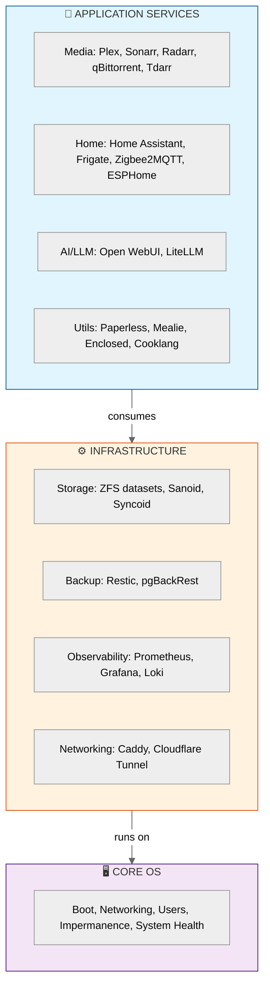
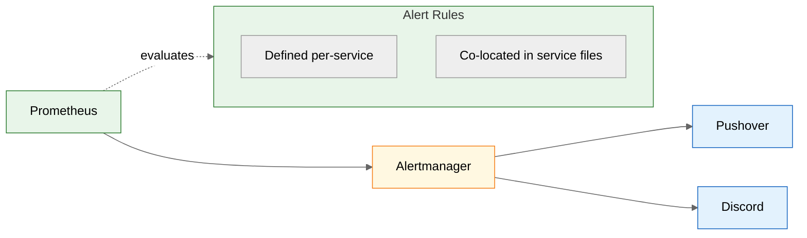

<h1 align="center">🏗️ Ryan's Homelab Infrastructure</h1>

<p align="center">
  <a href="https://nixos.org"></a>
  <a href="https://wiki.nixos.org/wiki/Flakes"></a>
  <a href="https://github.com/LnL7/nix-darwin"></a>
  <a href="https://github.com/nix-community/home-manager"></a>
</p>

> [!WARNING]
> **Personal Configuration Repository — Not a Template**
>
> This is my **personal infrastructure configuration** tailored for my specific hardware, network topology, and homelab environment. It is **not designed to be cloned and deployed by others**.
>
> - Contains hardcoded hostnames, IP addresses, and domain names (`holthome.net`)
> - References my specific hardware (Intel i9-9900K, GTX 1080 Ti, specific NIC names)
> - Depends on my personal SOPS/age keys — secrets will not decrypt for you
> - Assumes my ZFS pool layouts (`tank`, `rpool`, `backup`) and NAS topology
> - Expects my network infrastructure (VLANs, DNS, Cloudflare tunnels)
>
> **Use this repository as a learning resource for patterns and ideas, not as a starting point for your own config.** If you're new to NixOS, start with [nix.dev](https://nix.dev) or the [official NixOS manual](https://nixos.org/manual/nixos/stable/).

<p align="center">
  <em>Personal Infrastructure-as-Code managing NixOS servers, macOS workstation, and user environments through Nix flakes.</em>
</p>

---

## 📑 Table of Contents

- [Highlights](#-highlights)
- [Repository Structure](#-repository-structure)
- [Architecture](#-architecture)
- [Operational Commands](#-operational-commands)
- [My Systems](#-my-systems)
- [Services on Forge](#-services-on-forge)
- [Observability Stack](#-observability-stack)
- [Backup Architecture](#-backup-architecture)
- [Security](#-security)
- [Documentation](#-documentation)
- [Development Notes](#-development-notes)
- [Acknowledgments](#-acknowledgments)

---

## ✨ Highlights

- **Multi-System Management**: NixOS servers (homelab, cloud), macOS workstations, and unified user environments
- **Three-Tier Architecture**: Clear separation between core OS, infrastructure, and application services
- **43+ Managed Services**: Media automation, home automation, AI/LLM, monitoring, and more on the `forge` host
- **Enterprise Patterns**: Declarative backups with Restic + pgBackRest, Prometheus/Grafana observability, Gatus status pages
- **Secure by Default**: SOPS-encrypted secrets, PocketID SSO, Caddy reverse proxy with automatic TLS
- **ZFS-First Storage**: Per-service datasets with optimized recordsizes, Sanoid snapshots, Syncoid replication
- **Disaster Recovery**: Preseed patterns for automatic service restoration from backups

---

## 📁 Repository Structure

```text
.
├── flake.nix                 # Flake entrypoint - inputs and outputs
├── flake.lock                # Locked dependency versions for reproducibility
├── Taskfile.yaml             # Task runner commands for operations
│
├── hosts/                    # Host-specific configurations
│   ├── _modules/             # Reusable NixOS/Darwin modules
│   │   ├── common/           # Cross-platform modules
│   │   ├── darwin/           # macOS-specific modules
│   │   ├── nixos/            # NixOS-specific modules (70+ service modules)
│   │   └── lib/              # Shared type definitions and helpers
│   │
│   ├── forge/                # Primary homelab server (NixOS)
│   │   ├── core/             # OS-level: boot, networking, users
│   │   ├── infrastructure/   # Cross-cutting: storage, backup, observability
│   │   ├── services/         # 43+ application services
│   │   └── lib/              # Host-specific helpers (forgeDefaults)
│   │
│   ├── luna/                 # Secondary server (NixOS)
│   ├── nas-1/                # NAS configuration (NixOS)
│   ├── rymac/                # MacBook Pro (nix-darwin)
│   └── rydev/                # Development VM (NixOS)
│
├── home/                     # Home Manager configurations
│   ├── _modules/             # Reusable home modules
│   └── ryan/                 # User-specific config with per-host overrides
│
├── profiles/                 # Composable system profiles
│   ├── hardware/             # Hardware-specific (Intel GPU, Coral TPU)
│   └── user/                 # User environment profiles
│
├── pkgs/                     # Custom packages
│   ├── nvfetcher.toml        # Source definitions for auto-updates
│   └── _sources/             # Generated source metadata
│
├── overlays/                 # Package overlays and modifications
│
└── docs/                     # 50+ documentation files
    ├── modular-design-patterns.md
    ├── monitoring-strategy.md
    ├── backup-system-onboarding.md
    └── ...
```

---

## 🏗️ Architecture

### Three-Tier Organization (Forge Host)

The `forge` host demonstrates our architectural approach, separating concerns into three distinct layers:



### Key Design Patterns

#### Contribution Pattern

Services co-locate their own infrastructure needs. Each service file contains:

- Service configuration
- Storage dataset declaration (`modules.storage.datasets`)
- Backup policy (`modules.backup.sanoid.datasets`)
- Monitoring alerts (`modules.alerting.rules`)

```nix
# Example: hosts/forge/services/sonarr.nix
{
  modules.services.sonarr = {
    enable = true;
    backup = forgeDefaults.backup;
  };

  # Co-located storage
  modules.storage.datasets.services.sonarr = {
    mountpoint = "/var/lib/sonarr";
    recordsize = "16K";  # Optimized for SQLite
  };

  # Co-located backup policy
  modules.backup.sanoid.datasets."tank/services/sonarr" =
    forgeDefaults.mkSanoidDataset "sonarr";

  # Co-located monitoring
  modules.alerting.rules."sonarr-service-down" =
    forgeDefaults.mkServiceDownAlert "sonarr" "Sonarr" "TV series management";
}
```

#### Native > Container Philosophy

We prefer native NixOS services over containers when available:

- Better systemd integration
- Simplified updates via `nix flake update`
- No container user/permission mapping complexity
- Direct filesystem access without volume mounts

Containers are used when:

- No native NixOS module exists
- Application explicitly requires containerization
- Rapid prototyping before native implementation

<br>

#### Standardized Submodules

All services use consistent submodule patterns from `hosts/_modules/lib/types.nix`:

- `reverseProxy` - Caddy integration with TLS and auth
- `metrics` - Prometheus scrape configuration
- `logging` - Promtail/Loki log shipping
- `backup` - Restic backup integration
- `notifications` - Alert routing

---

## 🔧 Operational Commands

> [!NOTE]
> These commands are for the repository maintainer. They will not work on your system without significant adaptation (secrets, hostnames, network configuration, etc.).

### Deployment

```bash
# List available tasks
task --list

# Validate configuration
task nix:validate

# Deploy to NixOS host
task nix:apply-nixos host=forge NIXOS_DOMAIN=holthome.net

# Deploy to Darwin host
task nix:apply-darwin host=rymac

# Build without applying (test)
task nix:build-nixos host=forge
```

### Common Operations

```bash
# Update all flake inputs
task nix:update

# Update specific input
task nix:update input=nixpkgs

# Compare system generations
task nix:diff host=forge

# Edit encrypted secrets
task sops:edit host=forge

# Re-encrypt all secrets (after key changes)
task sops:re-encrypt

# Check backup status
task backup:status

# Orchestrate backups before major changes
task backup:orchestrate
```

---

## 🖥️ My Systems

> These are my actual machines with specific hardware. Configuration assumes this exact topology.
> See **[hosts/README.md](hosts/README.md)** for detailed hardware specs, network topology, and VLAN structure.

| Host | Platform | Hardware | Role |
|------|----------|----------|------|
| `forge` | NixOS | Intel i9-9900K, 32GB RAM, GTX 1080 Ti + Intel UHD 630, 2×NVMe (ZFS mirror) | Primary homelab (43+ services) |
| `nas-0` | TrueNAS | Intel i3-7100, 64GB RAM, 28×HDD (14 mirrored vdevs, 117TB) | Primary storage, NFS exports |
| `nas-1` | NixOS | Intel i3-7100, 32GB RAM, 4×HDD (RAIDZ1, 51TB raw) | Backup target, ZFS replication |
| `luna` | NixOS | Intel Celeron J3455, 8GB RAM, 128GB SSD | Infrastructure services |
| `rymac` | nix-darwin | Apple M1 Max, 32GB RAM | MacBook Pro workstation |
| `rydev` | NixOS | VM (aarch64) | Development environment |

**Network**: Mikrotik CCR2004-16G-2S+ router with VLANs (Servers/10.20.x, Wired/10.10.x, Wireless/10.30.x, IoT/10.40.x, Video/10.50.x)

---

## 🔧 Services on Forge

### Media & Entertainment

| Service | Description | Monitoring |
|---------|-------------|------------|
| Plex | Media server | Gatus + Prometheus |
| Sonarr/Radarr/Bazarr | *arr stack for automation | Prometheus alerts |
| qBittorrent + cross-seed | Download clients | Service health |
| Tdarr | Transcoding automation | GPU metrics |
| Tautulli | Plex analytics | - |

### Home Automation

| Service | Description | Monitoring |
|---------|-------------|------------|
| Home Assistant | Automation platform | Gatus + alerts |
| Frigate | NVR with AI detection | Coral TPU metrics |
| Zigbee2MQTT | Zigbee coordinator | MQTT health |
| Z-Wave JS UI | Z-Wave coordinator | Service health |
| ESPHome | IoT firmware builder | - |

### AI & LLM

| Service | Description |
|---------|-------------|
| Open WebUI | Chat interface |
| LiteLLM | Unified AI gateway |

### Infrastructure

| Service | Description |
|---------|-------------|
| Caddy | Reverse proxy + TLS |
| PostgreSQL | Database + pgBackRest |
| Prometheus/Grafana/Loki | Observability stack |
| Gatus | Status page |
| PocketID | SSO/OIDC provider |

### Utilities

| Service | Description |
|---------|-------------|
| Paperless-ngx | Document management |
| Mealie | Recipe manager |
| Cooklang | Recipe markup |
| Enclosed | Encrypted notes |

---

## 📊 Observability Stack

### Black-Box Monitoring (Gatus)

User-facing availability checks displayed on public status page:

- HTTP/HTTPS endpoint health
- DNS resolution verification
- Certificate expiry warnings

### White-Box Monitoring (Prometheus)

Internal metrics and predictive alerting:

- System resources (node_exporter)
- Container health
- ZFS pool/dataset metrics
- Application-specific exporters

### Alerting Flow



See [docs/monitoring-strategy.md](docs/monitoring-strategy.md) for detailed guidance.

---

## 💾 Backup Architecture

### Multi-Layer Strategy

1. **ZFS Snapshots** (Sanoid) - Hourly/daily/weekly/monthly local snapshots
2. **ZFS Replication** (Syncoid) - Local replication to nas-1
3. **Restic** - Encrypted backups to NAS (local) + Cloudflare R2 (offsite)
4. **pgBackRest** - PostgreSQL PITR to Cloudflare R2 (offsite)

### Disaster Recovery

Services support automatic restoration via preseed pattern:

```nix
preseed = forgeDefaults.mkPreseed [ "syncoid" "local" "restic" ];
```

See [docs/backup-system-onboarding.md](docs/backup-system-onboarding.md) for complete documentation.

---

## 🔐 Security

### Secrets Management

All secrets encrypted with SOPS using age keys:

```bash
task sops:edit host=forge
```

### Authentication

- **PocketID**: Passkey-first OIDC provider
- **Caddy**: Forward auth integration for all services
- **Access Groups**: admin, home, media with different access levels

### Network Security

- Services bind to localhost only
- Caddy handles TLS termination
- Cloudflare Tunnel for external access (no port forwarding)

---

## 📚 Documentation

Key documentation files in `docs/`:

| Document | Description |
|----------|-------------|
| [modular-design-patterns.md](docs/modular-design-patterns.md) | Service module architecture |
| [monitoring-strategy.md](docs/monitoring-strategy.md) | Black-box vs white-box monitoring |
| [backup-system-onboarding.md](docs/backup-system-onboarding.md) | Backup configuration guide |
| [persistence-quick-reference.md](docs/persistence-quick-reference.md) | ZFS dataset patterns |
| [custom-package-patterns.md](docs/custom-package-patterns.md) | nvfetcher and package updates |

---

## 🛠️ Development Notes

> Personal notes for maintaining this configuration.

### Validation

```bash
# Full flake check
task nix:validate

# Host-specific validation (faster)
task nix:validate host=forge

# Test in VM (Linux only)
task nix:test-vm host=rydev
```

### Adding a New Service (Personal Workflow)

1. Check for native NixOS module first ([search.nixos.org](https://search.nixos.org))
2. Create service file: `hosts/forge/services/myservice.nix`
3. Import in `hosts/forge/default.nix`
4. Follow contribution pattern (service + storage + backup + alerts)
5. Use `forgeDefaults` helpers for consistency

See [docs/modular-design-patterns.md](docs/modular-design-patterns.md) for detailed patterns.

<br>

### Package Updates

```bash
# Update nvfetcher sources
nix run .#nvfetcher

# Update package hashes with nix-update
task nix:update-package package=cooklang-cli
```

---

## 🙏 Acknowledgments

This configuration draws inspiration from:

- [EmergentMind/nix-config](https://github.com/EmergentMind/nix-config)
- [hlissner/dotfiles](https://github.com/hlissner/dotfiles)
- [bjw-s/nix-config](https://github.com/bjw-s/nix-config)
- [ryan4yin/nix-config](https://github.com/ryan4yin/nix-config)

---

## 📝 Disclaimer & License

This repository is shared for **educational and reference purposes only**.

**What you can do:**

- Study the patterns and architectural decisions
- Adapt ideas and code snippets for your own configurations
- Use the documentation as a learning resource

**What you should understand:**

- ❌ **No support**: Issues asking "how do I use this on my system" will be closed
- ❌ **No stability guarantees**: Breaking changes happen frequently without notice
- ❌ **No portability**: This configuration is tested only on my specific hardware
- ❌ **Secrets won't work**: You cannot decrypt my SOPS secrets

**Better starting points for your own NixOS journey:**

- [nix.dev](https://nix.dev) — Modern Nix documentation
- [NixOS Manual](https://nixos.org/manual/nixos/stable/) — Official reference
- [nix-starter-configs](https://github.com/Misterio77/nix-starter-configs) — Minimal templates
- [nixos-hardware](https://github.com/NixOS/nixos-hardware) — Hardware-specific modules

---

*This is an actively maintained personal infrastructure. Patterns evolve as better approaches are discovered.*
