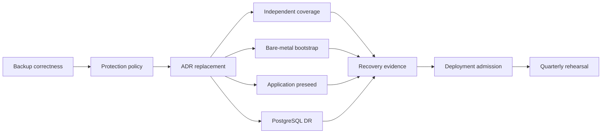

# Forge Backup and Disaster Recovery Improvement Plan

Date: 2026-07-13
Status: In progress
Scope: Forge backup correctness, independent recovery, preseed, PostgreSQL, verification, and deployment admission

## Executive Outcome

Forge must be recoverable from a clean replacement host without relying on the failed host, silently accepting incomplete backups, or starting stateful services with unvalidated empty data.

The program is complete when a timed bare-metal rehearsal demonstrates that:

1. `/persist` and `/home` recover through an external operator identity.
2. The restored SSH host identity decrypts SOPS without recipient rotation.
3. Every critical application restores a validated recovery point.
4. PostgreSQL restores with either NAS or R2 unavailable.
5. No critical service starts empty unless an explicit first-deployment policy permits it.
6. Onsite and offsite recovery points meet declared RPO and RTO objectives.
7. Backup, restore, and deployment health are derived from actual outcomes rather than unit presence.

## Decision Method

Decisions in this program are evaluated in this order:

1. Safety and recovery invariants
2. Observed failure behavior
3. Declared RPO and RTO
4. Executable recovery tests
5. Implementation simplicity and least privilege
6. Existing repository conventions
7. Existing ADRs and historical implementations

ADRs record prior decisions. They are not constraints when their assumptions or principles are weak. An ADR that conflicts with levels 1 through 5 must be revised or superseded.

## Recovery Invariants

- A backup is healthy only when it is complete and restorable.
- No stateful service silently starts empty.
- Recovery credentials remain independent of the failed host.
- Critical data spans independent failure domains.
- Restores occur in staging, are validated, and are promoted atomically.
- Recovery points are selected by validity and freshness; tool preference is only a tie-breaker.
- Automation fails closed unless empty bootstrap is explicitly authorized.
- Every dataset has a machine-readable protection policy.
- Recovery claims require recurring drills.
- Recovery procedures work without Forge itself.
- Preserving ZFS lineage is useful but subordinate to recovering valid data.
- Monitoring and recovery are complementary: failover must still alert on degraded infrastructure.

## Evidence Baseline

The baseline below reflects current `main` and live Forge observations on 2026-07-13.

### Current Strengths

- `task bootstrap:remote-install host=forge RECOVER=true` breaks the `/persist` and SOPS dependency cycle by using the operator's forwarded SSH agent.
- `nixos-bootstrap` mounts `rpool/safe/persist` and `rpool/safe/home` with `neededForBoot` and reads SSH host keys directly from `/persist`.
- `nas-1` contains current replicated snapshots for `/persist`, `/home`, and every application with an enabled generic preseed unit.
- Forge has frequent Sanoid snapshots and Syncoid replication; the target was reachable with no failed replication units during review.
- PostgreSQL pgBackRest repo1 and repo2 were healthy, carried current WAL, and PostgreSQL reported no archive failures.
- The guarded deployment script persists and restores paused timer state across interruption.
- The Forge toplevel, bootstrap toplevel, flake checks, and operational shell scripts evaluated or linted successfully during review.

### Current Risks

- All 52 evaluated unified Restic jobs target `nas-primary`; no current application job targets `r2-offsite`.
- Restic exit code 3 is treated as success. Sixteen observed jobs created incomplete snapshots with permission errors while metrics remained green.
- Repository verification and restore-test services exist, but no corresponding timers are evaluated on current `main`.
- Generic preseed marks failed restore attempts complete, exits successfully, and permits empty service startup.
- Application services generally `Want=` rather than `Require=` their preseed units.
- Several active stateful datasets have no generic preseed unit despite having NAS replicas.
- The boot-time `preseed-system-*` units are inert and would recreate a SOPS dependency cycle if wired to the normal replication key.
- PostgreSQL repo2 fallback is blocked by the hard repo1 NFS mount dependency.
- The R2-only pgBackRest incremental job also requires the NFS mount.
- The post-preseed baseline service has no explicit trigger.
- The claimed repo1-only stanza fallback repeats an all-repository pgBackRest command.
- The pgBackRest spool alert queries a filesystem mountpoint that does not exist.
- The backup orchestrator inherits false Restic success and starts supposed parallel Restic jobs synchronously.
- Deployment quiescing omits some prune, verification, reporting, and cleanup units.

### Historical Candidate Work

Commit `ac0592d2` (`backup/dr: offsite coverage, verification timers, preseed restore fixes`) is not merged into `main`. It lives on `origin/claude/nix-home-config-review-h8gwh4`.

It may contain useful implementation fragments, but it must not be cherry-picked wholesale. Each hunk must independently satisfy this plan's invariants and acceptance tests.

## Proposed Protection Classes

Initial objectives are proposals and should be confirmed during the protection inventory.

| Class | Required protection | Proposed objective |
| --- | --- | --- |
| System identity | ZFS, NAS replication every 15 minutes, daily R2, external bootstrap | RPO 15 minutes onsite / 24 hours offsite; RTO 1 hour |
| Critical state | ZFS, NAS replication every 15 minutes, daily NAS and R2 Restic | RPO 15 minutes onsite / 24 hours offsite; RTO 2 hours |
| Standard state | ZFS, NAS replication, daily NAS Restic, policy-based R2 | RPO 24 hours; RTO 8 hours |
| Rebuildable state | Explicit ephemeral classification | No recovery guarantee |
| PostgreSQL | pgBackRest NFS and R2 plus continuous WAL | RPO 5 minutes; RTO 2 hours |

Initial critical candidates include `/persist`, `/home`, PostgreSQL, PocketID, Home Assistant, Zigbee2MQTT, Z-Wave JS UI, n8n, and document or application state that cannot be recreated.

## Phase 0: Correct Current Backups

Status: In progress
Priority: Immediate

### Deliverables

- [x] Treat Restic exit code 3 as incomplete and failed.
- [x] Remove `SuccessExitStatus = [ 3 ]`.
- [x] Preserve the prior complete-backup timestamp on partial and failed runs.
- [x] Export distinct complete, partial, and failed result metrics.
- [x] Ensure partial runs trigger failure notification rather than success notification.
- [x] Repair read access for every observed affected job without broad source permission weakening.
- [x] Ensure temporary snapshot and lock state is cleaned before replication resumes.
- [ ] Run the 16 affected jobs and then the complete expected job set.
- [ ] Keep incomplete snapshots until clean replacements exist, then expire them deliberately.
- [x] Add generated-unit regression checks for result handling, capability confinement, credentials, and cleanup ordering.
- [x] Add executable mocked tests for exit codes 0, 3, fatal nonzero, and interruption.

### Acceptance Gate

- Every expected job completes twice consecutively without unreadable files.
- A controlled exit-code-3 run produces a failed unit, partial metric, preserved previous success timestamp, and failure notification.
- No source dataset permissions are weakened merely to satisfy backup reads.
- A sample file from each previously affected job restores successfully.

### Rollout Controls

- Test one small snapshot-based job before large datasets such as Plex.
- Monitor ZFS allocation, CPU temperature, and backup duration while changing clone access.
- Do not prune prior snapshots until a complete replacement has been verified.

## Phase 1: Establish Protection Policy

Status: In progress

### Deliverables

- [ ] Inventory and classify every Forge dataset as system, critical, standard, or ephemeral.
- [ ] Record RPO, RTO, consistency requirement, repositories, preseed behavior, validator, and empty-bootstrap policy.
- [x] Add a shared protection type through `mylib.types`.
- [x] Generate `/etc/homelab/protection-manifest.json` from evaluated configuration.
- [ ] Add assertions for unclassified datasets and missing required protection tiers.
- [x] Add explicit mechanism exceptions, such as PostgreSQL using pgBackRest.
- [ ] Generate backup, replication, preseed, monitoring, and status tooling from the same manifest.
- [ ] Correct nested contribution gaps such as Beszel.

### Acceptance Gate

Nix evaluation fails when irreproducible state is unclassified or lacks the protection required by its class.

## Phase 2: Replace the Architectural Decision

Status: Not started

### Deliverables

- [ ] Draft ADR-012, `Recovery Invariants and Protection Policy`, from the completed inventory and tested prototypes.
- [ ] Include evidence, assumptions, failure modes, rejected alternatives, falsifying conditions, and a review date.
- [ ] Treat ZFS lineage as a preference rather than a reason to leave valid offsite data unused.
- [ ] Permit automated Restic recovery only when restore is transactional, validated, observable, and followed by replication re-baselining.
- [ ] Mark ADR-007 superseded only after ADR-012's recovery tests pass.
- [ ] Keep ADR-007 unchanged as historical context.

### Acceptance Gate

The new decision is justified by explicit objectives and executable evidence rather than inherited rationale.

## Phase 3: Complete Independent Backup Coverage

Status: Not started

### Deliverables

- [ ] Replace singular `repository` with backward-compatible `repositories`.
- [ ] Generate independent physical jobs for each logical job and repository pair.
- [ ] Add R2 coverage for system identity and critical services first.
- [ ] Add policy-driven R2 coverage for standard services after cost and duration measurement.
- [ ] Give NAS and R2 independent schedules, retention, metrics, and alerts.
- [ ] Make remote repository initialization an explicit administrative operation.
- [ ] Evaluate immutable retention or credentials that separate routine writers from prune and delete authority.
- [ ] Add an offsite `/persist` and `/home` recovery path using externally supplied credentials.

### Acceptance Gate

Every critical item has current NAS and R2 recovery points, and an R2-only restore succeeds using the external recovery kit.

## Phase 4: Harden Bare-Metal Bootstrap

Status: Not started

### Deliverables

- [ ] Keep `/persist` and `/home` recovery outside normal boot-time preseed.
- [ ] Remove or explicitly disable the misleading `preseed-system-*` units.
- [ ] Preserve `RECOVER=true` as the supported system-recovery control plane.
- [ ] Pin the NAS host key instead of accepting `ssh-keyscan` output.
- [ ] Verify forwarded-agent access and source snapshots before formatting.
- [ ] Validate source freshness and expected dataset names.
- [ ] Restore the correct `rpool/safe/*` datasets.
- [ ] Verify restored SSH private and public keys, ownership, and modes.
- [ ] Prove SOPS decryption before reboot.
- [ ] Add `RECOVER_SOURCE=nas|r2` after offsite system backups exist.
- [ ] Emit a machine-readable recovery report.

### Acceptance Gate

A clean bootstrap restores the original host identity and decrypts SOPS without recipient rotation.

## Phase 5: Redesign Application Preseed

Status: Not started

### Deliverables

- [ ] Discover candidate recovery points and reject stale, incomplete, or unverified candidates.
- [ ] Prefer ZFS only when it is at least as fresh and valid as alternatives.
- [ ] Restore into a staging dataset.
- [ ] Run a service-specific validator before promotion.
- [ ] Promote atomically and record source, recovery point, validation, and duration metadata.
- [ ] Re-establish Syncoid lineage after a Restic restore.
- [ ] Never mark completion after failed restore.
- [ ] Make main service startup require preseed success.
- [ ] Add `allowEmptyBootstrap`, defaulting to false.
- [ ] Fail on nonempty data without a valid completion record.
- [ ] Add preseed coverage or an explicit ephemeral decision for every active stateful dataset.

### Acceptance Gate

Injected recovery failure leaves the service stopped, preserves existing data, and never records completion.

## Phase 6: Make PostgreSQL Recovery Independent

Status: Not started

### Deliverables

- [ ] Remove the hard NFS prerequisite from fallback-capable preseed.
- [ ] Use bounded repo1 health checks and select repo2 without touching NFS when repo1 is unavailable.
- [ ] Remove NFS dependencies from R2-only backup jobs.
- [ ] Split repo1 and repo2 full backups so one cannot prevent the other.
- [ ] Explicitly trigger post-preseed baseline creation.
- [ ] Remove the ineffective repo1-only stanza retry or use a real temporary repo1-only configuration.
- [ ] Document that WAL currently archives to both configured repositories.
- [ ] Alert directly on spool bytes and queue files.
- [ ] Validate expected databases, extensions, recovery completion, and writability after restore.

### Acceptance Gate

With NAS unavailable, PostgreSQL restores from R2 and dependent applications pass smoke tests.

## Phase 7: Build Executable Recovery Evidence

Status: Not started

### Deliverables

- [ ] Add weekly repository checks and monthly restore-test timers.
- [ ] Fix timing-variable and atomic metric-file defects.
- [ ] Treat missing recent snapshots as verification failure.
- [ ] Use structured Restic JSON for sample selection.
- [ ] Test newest, middle, and oldest retained recovery points.
- [ ] Add semantic validators such as SQLite integrity, JSON or YAML parsing, expected files, and isolated health checks.
- [ ] Restore one rotating critical application into temporary storage each month.
- [ ] Perform an R2-only PostgreSQL restore each quarter.
- [ ] Add Nix evaluation tests, mocked shell tests, and lab-based ZFS integration tests.

### Acceptance Gate

Every critical service has a non-stale full-restore result and a measured RTO.

## Phase 8: Make Deployment Policy-Aware

Status: Not started

### Deliverables

- [ ] Check complete backups, RPO, replication lag, pgBackRest health, and drill freshness before activation.
- [ ] Replace timer-name regexes with a generated maintenance target or shared deployment lock.
- [ ] Fix orchestrator concurrency with nonblocking systemd starts.
- [ ] Block deployment when any critical-service protection requirement fails.
- [ ] Replace the percentage-based acceptable-failure policy with class-based policy.
- [ ] Add a reason-bearing emergency override and audit trail.
- [ ] Alert on stale paused-timer markers and missing expected timers.
- [ ] Include cooling telemetry in admission for high-load backup and deployment operations.

### Acceptance Gate

Incomplete critical protection blocks deployment, while interruption always restores timers and locks.

## Phase 9: Institutionalize Recovery

Status: Not started

### Deliverables

- [ ] Create one canonical `docs/forge-disaster-recovery.md`.
- [ ] Mark contradictory documents obsolete or redirect them to the canonical runbook.
- [ ] Maintain an independent recovery kit containing the admin age identity, Restic password, R2 read credentials, NAS access, pinned host keys, disk mapping, and a known-good revision.
- [ ] Add a read-only `task backup:dr-preflight`.
- [ ] Conduct quarterly bare-metal rehearsals on isolated disks or spare hardware.
- [ ] Record actual RPO, RTO, failures, and corrective actions.
- [ ] Review ADR-012 after every exercise or material topology change.

### Acceptance Gate

An operator using a clean machine and the independent recovery kit completes the documented recovery without access to the original Forge host.

## Delivery Dependencies

## Validation Matrix

| Change type | Required validation |
| --- | --- |
| Nix option or assertion | Focused `nix eval`, `nix flake check`, Forge toplevel evaluation |
| Generated systemd unit | Evaluate unit attributes and inspect `systemctl cat` after deployment |
| Shell behavior | `shellcheck` plus focused mocked command test |
| Backup result semantics | Controlled exit-code test and Prometheus metric assertion |
| ZFS snapshot or preseed | Isolated dataset test before any production dataset exercise |
| Repository fan-out | Independent NAS and R2 backup plus restore |
| PostgreSQL recovery | Temporary cluster restore with one repository unavailable |
| Bootstrap recovery | LiveCD or equivalent isolated bare-metal rehearsal |
| Deployment admission | Healthy, stale, interrupted, and emergency-override scenarios |

## Rollout Principles

- Make small changes and validate the narrow behavior before expanding scope.
- Do not combine backup correctness, permission migration, and repository fan-out in one deployment.
- Avoid destructive tests against production datasets.
- Retain old recovery points until their replacements are validated.
- Stagger initial R2 uploads and full restore drills to control I/O and thermal load.
- Prefer reversible configuration and explicit migration markers.
- Record each acceptance result in this document or the canonical recovery runbook.

## Definition of Done

The improvement program is complete only when all of the following are demonstrated:

- [ ] A wiped replacement Forge restores `/persist` and `/home` through an external identity.
- [ ] The restored identity decrypts SOPS without recipient rotation.
- [ ] Every critical application restores validated data.
- [ ] PostgreSQL restores with NAS unavailable and with R2 unavailable in separate tests.
- [ ] No critical service starts empty without an explicit policy.
- [ ] Every protected dataset has current recovery points in all required failure domains.
- [ ] Backup health distinguishes complete, partial, failed, and stale states.
- [ ] Full restore evidence and measured RTO remain within policy.
- [ ] Deployment admission consumes the same protection manifest.
- [ ] The complete workflow succeeds in a timed quarterly rehearsal.

## Progress Log

### 2026-07-13

- Completed repository and live Forge review.
- Verified the two-phase `/persist` and SOPS recovery boundary.
- Established first-principles recovery invariants.
- Confirmed `ac0592d2` is not merged into current `main`.
- Added Phase 0 generated-unit regression checks to `nix flake check`.
- Deployed fail-closed Restic result semantics and one-hot result metrics to Forge.
- Converted the eight observed direct-path failures to ZFS clone backups.
- Added a metadata-preserving, positive-allowlist systemd namespace with unit-scoped `CAP_DAC_READ_SEARCH` for snapshot jobs.
- Removed clone permission mutation, including the former Omada workaround.
- Fixed snapshot cleanup ordering so Syncoid remains blocked until temporary ZFS state is gone.
- Updated guarded deployment to pause timers and drain in-flight backup oneshots through systemd ordering instead of racing repeated activation attempts.
- Added `task backup:validate-restic job=<name> -- --run` for repeatable per-job acceptance checks.
- Built and activated the Phase 0 configuration on Forge with all backup timers restored.
- Validated complete backups, correct one-hot metrics, and clean teardown for Actual, Apprise, Bichon, Cooklang, Cooklang Federation, ESPHome, Grafana OnCall, Home Assistant, Music Assistant, NetVisor, and Radarr.
- Stopped the forced validation batch after ESPHome reached its 2 GiB memory ceiling and Forge peaked at 85 C; all timers and temporary state were restored cleanly.
- Plex, SABnzbd, TDarr, Termix, and Tududi remain pending and will validate through staggered timers rather than another forced high-load batch.
- Added `task backup:test-restic-results` and proved complete, partial, fatal, and TERM-interrupted outcomes against the deployed wrapper without touching a real repository or production metric.
- Added `task backup:test-restic-restore` and restored real files with matching size, mode, UID, and GID from Actual, Home Assistant, Music Assistant, and ESPHome snapshots.
- Full affected-job execution and per-job restore sampling remain open acceptance gates.
- Began Phase 1 with a nullable dataset protection policy using numeric RPO/RTO objectives and explicit required tiers.
- Generated an advisory manifest covering 64 managed and Sanoid-only datasets without enforcing classifications.
- Classified `/persist` and `/home` as system, Actual and Home Assistant as critical, and Prometheus as ephemeral; the manifest exposes their current missing tiers.
- Built and deployed the read-only manifest at `/etc/homelab/protection-manifest.json`; Forge retained all 115 backup timers with no failed units.
- Expanded advisory classification to 11 datasets using explicit evidence: six rebuildable datasets, two system datasets, and three critical datasets.
- Modeled PostgreSQL pgBackRest NAS/offsite and automated restore coverage while retaining `independent-restore` as a missing tier until the NFS-coupled fallback is fixed.
- Built and deployed the 11-dataset expansion; the live manifest reports PostgreSQL missing only `independent-restore`, with 115 backup timers active and no failed units.
- Extended the live inventory to 14 classified datasets by marking PocketID, Zigbee2MQTT, and Z-Wave JS UI critical; each reports only `offsite-backup` as missing.
- Extended the live inventory to 16 datasets by marking Alertmanager and Redis ephemeral. Redis retains AOF, snapshots, and replication for routine continuity, but may bootstrap empty because durable Tracearr records live in PostgreSQL.
- Established the first standard-state cohort for Autobrr, Bazarr, Prowlarr, Radarr, and Sonarr. The live inventory now classifies 21 datasets, and all five standard entries satisfy their required tiers without allowing empty bootstrap.
- Extended the live inventory to 25 datasets: Bichon is critical with only `offsite-backup` missing, while Apprise, ESPHome, and NetVisor are fully covered standard state. Guarded activation also drained a 20-job Syncoid wave that began during the deployment race window before switching safely.
