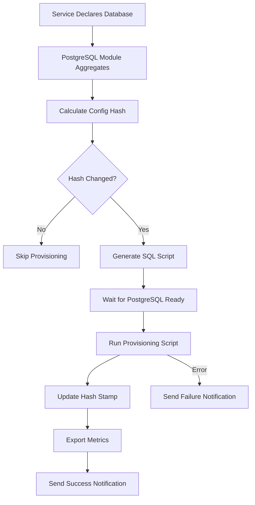

# PostgreSQL Point-in-Time Recovery (PITR) Guide

**Last Updated**: 2025-12-31

## Table of Contents

1. [Overview](#overview)
2. [Architecture](#architecture)
3. [Onboarding - Initial Setup](#onboarding-initial-setup)
4. [Daily Operations & Maintenance](#daily-operations-maintenance)
5. [Backup Management](#backup-management)
6. [Disaster Recovery](#disaster-recovery)
7. [Monitoring & Troubleshooting](#monitoring-troubleshooting)
8. [Advanced Topics](#advanced-topics)

---

## Overview

This guide covers the PostgreSQL PITR (Point-in-Time Recovery) module, which provides enterprise-grade backup and disaster recovery capabilities for PostgreSQL databases in your NixOS homelab.

### Key Features

- **Continuous WAL Archiving**: Automatic write-ahead log archiving for minimal data loss (5-minute RPO by default)
- **Automated Base Backups**: Daily full database backups via `pg_basebackup`
- **Point-in-Time Recovery**: Restore to any point in time, specific transaction, or named restore point
- **Multi-Method Restore**: Self-healing with syncoid → local snapshots → Restic fallback
- **ZFS Integration**: Optimal dataset configuration (8K recordsize for data, 128K for WAL)
- **Health Monitoring**: Prometheus metrics and automated health checks
- **Notification Integration**: Systemd OnFailure hooks with centralized alerting

### Architecture Highlights

- **Storage**: ZFS datasets with optimal properties for PostgreSQL workloads
- **Backup**: Restic for encrypted, deduplicated offsite storage
- **Replication**: Sanoid/Syncoid for ZFS snapshot replication to nas-1
- **Recovery**: Three-tier restore strategy with configurable methods

---

## Architecture

### Component Overview

```
┌─────────────────────────────────────────────────────────────────┐
│                     PostgreSQL Instance                          │
│  ┌─────────────────┐         ┌──────────────────┐              │
│  │   Data Directory │         │  WAL Archive Dir │              │
│  │  tank/services/  │         │  tank/services/  │              │
│  │  postgresql/main │         │  postgresql/     │              │
│  │                  │         │  main-wal        │              │
│  │  (8K recordsize) │         │  (128K recordsize)│             │
│  └─────────────────┘         └──────────────────┘              │
└─────────────────────────────────────────────────────────────────┘
           │                              │
           │                              │
           ├──────────────┬───────────────┤
           │              │               │
           ▼              ▼               ▼
    ┌─────────┐    ┌──────────┐   ┌──────────────┐
    │ Sanoid  │    │  Restic  │   │  Prometheus  │
    │ ZFS     │    │  Backup  │   │  Metrics     │
    │ Snapshots│   │  (NAS)   │   │              │
    └─────────┘    └──────────┘   └──────────────┘
           │              │
           ▼              ▼
    ┌─────────────────────────────┐
    │   nas-1.holthome.net        │
    │   ZFS Replication Target     │
    │   Restic Repository          │
    └─────────────────────────────┘
```

### Storage Layout

```
tank/services/postgresql/main/          # Main data directory
├── base/                                # Database files (8K blocks)
├── global/                              # Cluster-wide tables
├── pg_wal/                              # Write-ahead logs (symlink or local)
└── postgresql.conf

tank/services/postgresql/main-wal/      # WAL archive directory
├── incoming/                            # Temporary WAL staging
│   └── 000000010000000000000001.tmp
└── 000000010000000000000001             # Archived WAL files

/var/backup/postgresql/main/             # Base backup output
└── 20251011-120000/                     # Timestamped base backups
    ├── base.tar.gz
    └── pg_wal.tar.gz
```

---

## Onboarding - Initial Setup

### Prerequisites

Before deploying PostgreSQL with PITR, ensure:

1. **ZFS Pools**: `tank` pool exists and is healthy
2. **Backup Repository**: `primaryRepo` configured in `hosts/forge/default.nix`
3. **Secrets**: Restic password configured in SOPS (`restic/password`)
4. **Network**: NFS mount for nas-1 configured (if using preseed)
5. **Monitoring**: Node exporter enabled for metrics collection

### Step 1: Basic PostgreSQL Instance

Add to your `hosts/forge/default.nix`:

```nix
modules.services.postgresql.instances.main = {
  enable = true;
  version = "16";  # PostgreSQL 16 (default)
  port = 5432;

  # Memory tuning (adjust based on available RAM)
  sharedBuffers = "2GB";           # 25% of RAM
  effectiveCacheSize = "6GB";      # 75% of RAM
  workMem = "64MB";                # For complex queries
  maintenanceWorkMem = "512MB";    # For VACUUM, CREATE INDEX

  # Create initial databases
  databases = [ "app1" "app2" ];

  # Backup configuration
  backup = {
    walArchive.enable = true;
    walArchive.syncInterval = "*/5";    # 5-minute RPO
    walArchive.retentionDays = 30;

    baseBackup.enable = true;
    baseBackup.schedule = "daily";      # Daily full backups

    restic = {
      enable = true;
      repositoryName = primaryRepo.name;
      repositoryUrl = primaryRepo.url;
      passwordFile = primaryRepo.passwordFile;
    };
  };

  # Health checks
  healthCheck.enable = true;
  healthCheck.interval = "1min";

  # Monitoring integration
  monitoring.enable = true;
};
```

### Step 2: Deploy and Verify

```bash
# Build and deploy
cd /Users/ryan/src/nix-config
nixos-rebuild switch --flake .#forge --target-host forge.holthome.net

# Verify PostgreSQL is running
ssh forge.holthome.net "sudo systemctl status postgresql"

# Check health
ssh forge.holthome.net "sudo systemctl status postgresql-healthcheck-main.timer"
ssh forge.holthome.net "sudo journalctl -u postgresql-healthcheck-main -n 20"

# Verify datasets were created
ssh forge.holthome.net "zfs list | grep postgresql"
# Expected output:
# tank/services/postgresql/main          15.2G  900G  15.2G  /var/lib/postgresql/16/main
# tank/services/postgresql/main-wal       128K  900G   128K  /var/lib/postgresql/16/main-wal-archive
```

### Step 3: Verify Backup Jobs

```bash
# Check Restic backup jobs are registered
ssh forge.holthome.net "systemctl list-timers | grep postgresql"
# Expected:
# postgresql-basebackup-main.timer
# postgresql-healthcheck-main.timer
# postgresql-walprune-main.timer
# restic-backups-postgresql-main-wal.timer
# restic-backups-postgresql-main-base.timer

# Manually trigger first WAL backup
ssh forge.holthome.net "sudo systemctl start restic-backups-postgresql-main-wal"

# Check backup job status
ssh forge.holthome.net "sudo journalctl -u restic-backups-postgresql-main-wal -f"
```

### Step 4: Create Test Database

```bash
# Connect to PostgreSQL
ssh forge.holthome.net "sudo -u postgres psql"

# Create test data
CREATE TABLE test_pitr (
    id SERIAL PRIMARY KEY,
    created_at TIMESTAMP DEFAULT NOW(),
    data TEXT
);

INSERT INTO test_pitr (data) VALUES ('Initial data - ' || NOW());

# Verify
SELECT * FROM test_pitr;

\q
```

### Step 5: Verify WAL Archiving

```bash
# Check WAL archive directory
ssh forge.holthome.net "sudo ls -lh /var/lib/postgresql/16/main-wal-archive/"

# Check PostgreSQL is archiving
ssh forge.holthome.net "sudo -u postgres psql -c 'SELECT pg_switch_wal();'"
ssh forge.holthome.net "sudo -u postgres psql -c 'SELECT archived_count, failed_count FROM pg_stat_archiver;'"
```

---

## Daily Operations & Maintenance

### Monitoring Health

#### Check Service Status

```bash
# PostgreSQL main service
ssh forge.holthome.net "sudo systemctl status postgresql"

# Health check timer
ssh forge.holthome.net "sudo systemctl status postgresql-healthcheck-main.timer"

# Backup timers
ssh forge.holthome.net "systemctl list-timers | grep postgresql"
```

#### Prometheus Metrics

Metrics are exported to `/var/lib/node_exporter/textfile_collector/`:

```bash
# View current metrics
ssh forge.holthome.net "cat /var/lib/node_exporter/textfile_collector/postgresql_health.prom"
ssh forge.holthome.net "cat /var/lib/node_exporter/textfile_collector/postgresql_backup.prom"
ssh forge.holthome.net "cat /var/lib/node_exporter/textfile_collector/postgresql_wal_archive.prom"
```

**Key Metrics:**
- `postgresql_health{instance="main"}` - 1 = healthy, 0 = unhealthy
- `postgresql_backup_last_success_timestamp` - Unix timestamp of last successful backup
- `postgresql_wal_archive_files_present` - Number of WAL files in archive
- `postgresql_wal_archive_last_success_timestamp` - Last successful WAL archive

### Routine Maintenance Tasks

#### Weekly: Check Backup Status

```bash
# Check last 7 days of base backups
ssh forge.holthome.net "ls -lh /var/backup/postgresql/main/ | tail -7"

# Verify Restic snapshots
ssh forge.holthome.net "sudo restic -r /mnt/nas-backup snapshots --tag postgresql --tag main"

# Check for failed backups in last week
ssh forge.holthome.net "sudo journalctl --since '7 days ago' -u restic-backups-postgresql-main-base | grep -i error"
```

#### Monthly: Verify Recovery Capability

```bash
# Test WAL restore (non-destructive)
ssh forge.holthome.net "sudo systemctl start postgresql-healthcheck-main"
ssh forge.holthome.net "sudo journalctl -u postgresql-healthcheck-main -n 50"

# Verify replication to nas-1 (if configured)
ssh forge.holthome.net "zfs list -t snapshot tank/services/postgresql/main | tail -5"
ssh nas-1.holthome.net "zfs list -t snapshot backup/forge/services/postgresql/main | tail -5"
```

#### Quarterly: Full Recovery Test

Perform a full disaster recovery test on a separate test system (see [Disaster Recovery](#disaster-recovery) section).

### Database Maintenance

#### Vacuum and Analyze

```bash
# Manual VACUUM ANALYZE
ssh forge.holthome.net "sudo -u postgres vacuumdb --all --analyze --verbose"

# Check for bloat
ssh forge.holthome.net "sudo -u postgres psql" <<EOF
SELECT schemaname, tablename,
       pg_size_pretty(pg_total_relation_size(schemaname||'.'||tablename)) as size
FROM pg_tables
WHERE schemaname NOT IN ('pg_catalog', 'information_schema')
ORDER BY pg_total_relation_size(schemaname||'.'||tablename) DESC
LIMIT 10;
EOF
```

#### Connection Monitoring

```bash
# Check active connections
ssh forge.holthome.net "sudo -u postgres psql -c 'SELECT count(*) FROM pg_stat_activity;'"

# Check for long-running queries
ssh forge.holthome.net "sudo -u postgres psql" <<EOF
SELECT pid, age(clock_timestamp(), query_start), usename, query
FROM pg_stat_activity
WHERE query != '<IDLE>' AND query NOT ILIKE '%pg_stat_activity%'
ORDER BY query_start DESC;
EOF
```

---

## Backup Management

### Understanding Backup Components

#### 1. WAL Archives (Continuous)

- **Location**: `tank/services/postgresql/main-wal/`
- **Frequency**: Every time a WAL segment fills (typically 1-5 minutes)
- **Restic Job**: `restic-backups-postgresql-main-wal` (runs every 5 minutes)
- **Retention**: 30 days in local archive, longer in Restic

**Purpose**: Enables point-in-time recovery between base backups.

#### 2. Base Backups (Daily)

- **Location**: `/var/backup/postgresql/main/`
- **Frequency**: Daily (configurable via `backup.baseBackup.schedule`)
- **Restic Job**: `restic-backups-postgresql-main-base` (runs daily)
- **Method**: `pg_basebackup` with compression

**Purpose**: Full database snapshot for fast recovery.

#### 3. ZFS Snapshots (Hourly)

- **Location**: `tank/services/postgresql/main@sanoid_*`
- **Frequency**: Hourly (via Sanoid)
- **Retention**: 24h/7d/4w (configurable)
- **Replication**: Synced to nas-1 via Syncoid

**Purpose**: Fast local recovery, disaster recovery via replication.

### Manual Backup Operations

#### Trigger Immediate Base Backup

```bash
# Start base backup manually
ssh forge.holthome.net "sudo systemctl start postgresql-basebackup-main"

# Watch progress
ssh forge.holthome.net "sudo journalctl -u postgresql-basebackup-main -f"

# Verify completion
ssh forge.holthome.net "ls -lh /var/backup/postgresql/main/ | tail -1"
```

#### Force WAL Switch and Archive

```bash
# Force PostgreSQL to switch to new WAL file
ssh forge.holthome.net "sudo -u postgres psql -c 'SELECT pg_switch_wal();'"

# Manually trigger WAL sync to Restic
ssh forge.holthome.net "sudo systemctl start restic-backups-postgresql-main-wal"
```

#### Create Named Restore Point

```bash
# Create a restore point (useful before major operations)
ssh forge.holthome.net "sudo -u postgres psql" <<EOF
SELECT pg_create_restore_point('before_major_upgrade');
EOF

# View restore points in logs
ssh forge.holthome.net "sudo grep 'restore point' /var/lib/postgresql/16/main/log/postgresql-*.log | tail -5"
```

### Backup Verification

#### Verify Base Backup Integrity

```bash
# Check last base backup
BACKUP_PATH=$(ssh forge.holthome.net "ls -td /var/backup/postgresql/main/* | head -1")
ssh forge.holthome.net "sudo pg_verifybackup $BACKUP_PATH"
```

#### List Restic Snapshots

```bash
# All PostgreSQL snapshots
ssh forge.holthome.net "sudo restic -r /mnt/nas-backup snapshots --tag postgresql --tag main"

# WAL archive snapshots (last 10)
ssh forge.holthome.net "sudo restic -r /mnt/nas-backup snapshots --tag wal-archive --tag main --last 10"

# Base backup snapshots
ssh forge.holthome.net "sudo restic -r /mnt/nas-backup snapshots --tag base-backup --tag main"
```

#### Test WAL Restore

```bash
# Find a specific WAL file in Restic
WAL_FILE="000000010000000000000042"
ssh forge.holthome.net "sudo restic -r /mnt/nas-backup find $WAL_FILE --json"

# Verify it can be restored (dry run)
ssh forge.holthome.net "sudo restic -r /mnt/nas-backup restore latest --target /tmp/test-restore --include '**/$WAL_FILE'"
ssh forge.holthome.net "ls -lh /tmp/test-restore"
ssh forge.holthome.net "sudo rm -rf /tmp/test-restore"
```

---

## Disaster Recovery

### Recovery Scenarios

1. **Minor Data Loss**: Restore from recent ZFS snapshot (fastest, < 5 min)
2. **Database Corruption**: Point-in-time recovery from base backup + WAL replay
3. **Complete Server Loss**: Rebuild on new hardware with preseed automation
4. **Data Center Disaster**: Restore from offsite Restic repository

### Scenario 1: Quick Recovery from ZFS Snapshot

**Use Case**: Accidental DROP TABLE, unwanted data modification, application bug.

**RPO**: Up to 1 hour (last hourly snapshot)
**RTO**: 5-10 minutes

```bash
# 1. Stop PostgreSQL
ssh forge.holthome.net "sudo systemctl stop postgresql"

# 2. List available snapshots
ssh forge.holthome.net "zfs list -t snapshot tank/services/postgresql/main"

# 3. Choose a snapshot (e.g., 1 hour ago)
SNAPSHOT="tank/services/postgresql/main@sanoid_2025-10-11_14:00:00_hourly"

# 4. Rollback to snapshot
ssh forge.holthome.net "sudo zfs rollback -r $SNAPSHOT"

# 5. Start PostgreSQL
ssh forge.holthome.net "sudo systemctl start postgresql"

# 6. Verify database state
ssh forge.holthome.net "sudo -u postgres psql -c 'SELECT NOW();'"
```

### Scenario 2: Point-in-Time Recovery (PITR)

**Use Case**: Need to restore to exact moment before incident, or specific transaction.

**RPO**: 5 minutes (WAL archive interval)
**RTO**: 30-60 minutes

#### Step 1: Stop PostgreSQL and Backup Current State

```bash
# Stop PostgreSQL
ssh forge.holthome.net "sudo systemctl stop postgresql"

# Backup current data directory (just in case)
ssh forge.holthome.net "sudo mv /var/lib/postgresql/16/main /var/lib/postgresql/16/main.backup.$(date +%Y%m%d-%H%M%S)"
```

#### Step 2: Restore Base Backup

```bash
# Find latest base backup before incident
ssh forge.holthome.net "ls -lt /var/backup/postgresql/main/"

# Restore from base backup
BASE_BACKUP="/var/backup/postgresql/main/20251011-020000"
ssh forge.holthome.net "sudo mkdir -p /var/lib/postgresql/16/main"
ssh forge.holthome.net "sudo tar -xzf $BASE_BACKUP/base.tar.gz -C /var/lib/postgresql/16/main"
ssh forge.holthome.net "sudo chown -R postgres:postgres /var/lib/postgresql/16/main"
```

#### Step 3: Configure Recovery

```bash
# Create recovery configuration
ssh forge.holthome.net "sudo tee /var/lib/postgresql/16/main/recovery.signal" <<EOF
# Recovery signal file created by disaster recovery process
EOF

# Option A: Recover to specific time
ssh forge.holthome.net "sudo -u postgres psql -d postgres -c \"
ALTER SYSTEM SET recovery_target_time = '2025-10-11 14:30:00';
ALTER SYSTEM SET recovery_target_action = 'promote';
\""

# Option B: Recover to transaction ID
# ssh forge.holthome.net "sudo -u postgres psql -d postgres -c \"
# ALTER SYSTEM SET recovery_target_xid = '12345678';
# ALTER SYSTEM SET recovery_target_action = 'promote';
# \""

# Option C: Recover to named restore point
# ssh forge.holthome.net "sudo -u postgres psql -d postgres -c \"
# ALTER SYSTEM SET recovery_target_name = 'before_major_upgrade';
# ALTER SYSTEM SET recovery_target_action = 'promote';
# \""
```

#### Step 4: Start Recovery

```bash
# Start PostgreSQL in recovery mode
ssh forge.holthome.net "sudo systemctl start postgresql"

# Monitor recovery progress
ssh forge.holthome.net "sudo tail -f /var/lib/postgresql/16/main/log/postgresql-*.log"

# Look for:
# - "starting point-in-time recovery"
# - "restored log file from archive"
# - "recovery stopping before commit"
# - "database system is ready to accept connections"
```

#### Step 5: Verify and Promote

```bash
# Check if in recovery mode
ssh forge.holthome.net "sudo -u postgres psql -c 'SELECT pg_is_in_recovery();'"
# Should show 'f' (false) after promotion

# Verify data
ssh forge.holthome.net "sudo -u postgres psql -d app1 -c 'SELECT NOW(), COUNT(*) FROM your_table;'"

# Clean up backup
# ssh forge.holthome.net "sudo rm -rf /var/lib/postgresql/16/main.backup.*"
```

### Scenario 3: Complete Node Rebuild with Preseed

**Use Case**: Server hardware failure, complete OS reinstallation, migration to new hardware.

**RPO**: 5 minutes (last WAL archive)
**RTO**: 2-4 hours (includes OS installation)

#### Prerequisites

Enable preseed in your configuration:

```nix
modules.services.postgresql.instances.main = {
  # ... existing config ...

  preseed = {
    enable = true;  # Enable self-healing restore
    restoreMethods = [ "syncoid" "local" "restic" ];

    # Restic config for disaster recovery
    repositoryUrl = primaryRepo.url;
    passwordFile = primaryRepo.passwordFile;
    environmentFile = config.sops.secrets."restic/env".path;
  };
};
```

#### Step 1: Rebuild Node

```bash
# 1. Reinstall NixOS on new hardware (or existing hardware)
# 2. Ensure network connectivity and NFS mounts are working
# 3. Verify nas-1 is reachable
ping nas-1.holthome.net

# 4. Deploy configuration
nixos-rebuild switch --flake .#forge --target-host forge.holthome.net
```

#### Step 2: Preseed Automatic Restore

The preseed service will automatically run before PostgreSQL starts and attempt restore:

```bash
# Monitor preseed service
ssh forge.holthome.net "sudo journalctl -u preseed-postgresql-main -f"

# Restore hierarchy:
# 1. Try syncoid from nas-1 (fastest, full dataset)
# 2. Try local ZFS snapshot rollback (if any exist)
# 3. Try Restic restore (slowest, but works from offsite)
# 4. Create empty dataset (allows service to start)
```

#### Step 3: Manual Intervention (if needed)

If preseed fails or you need specific restore point:

```bash
# Check preseed status
ssh forge.holthome.net "sudo systemctl status preseed-postgresql-main"

# View logs for errors
ssh forge.holthome.net "sudo journalctl -u preseed-postgresql-main | tail -100"

# Manual Restic restore
ssh forge.holthome.net "sudo restic -r /mnt/nas-backup restore latest --target /var/lib/postgresql/16/main --tag base-backup --tag main"

# Fix ownership
ssh forge.holthome.net "sudo chown -R postgres:postgres /var/lib/postgresql/16/main"
```

#### Step 4: Verify and Resume Operations

```bash
# Check PostgreSQL started
ssh forge.holthome.net "sudo systemctl status postgresql"

# Verify database accessibility
ssh forge.holthome.net "sudo -u postgres psql -l"

# Check data integrity
ssh forge.holthome.net "sudo -u postgres psql -d app1 -c 'SELECT COUNT(*) FROM your_critical_table;'"

# Resume normal backups
ssh forge.holthome.net "sudo systemctl start postgresql-basebackup-main"
```

### Scenario 4: Restore from Offsite Restic Only

**Use Case**: All local storage lost, replication unavailable, nas-1 down.

**RPO**: Up to 24 hours (last base backup) + 5 minutes (WAL)
**RTO**: 2-6 hours

```bash
# 1. Deploy base PostgreSQL configuration
nixos-rebuild switch --flake .#forge --target-host forge.holthome.net

# 2. Stop PostgreSQL
ssh forge.holthome.net "sudo systemctl stop postgresql"

# 3. List available Restic snapshots
ssh forge.holthome.net "sudo restic -r /mnt/nas-backup snapshots --tag base-backup --tag main"

# 4. Restore latest base backup
SNAPSHOT_ID="abc123def"
ssh forge.holthome.net "sudo restic -r /mnt/nas-backup restore $SNAPSHOT_ID --target /var/lib/postgresql/16/main"

# 5. Restore WAL archives for PITR
ssh forge.holthome.net "sudo mkdir -p /var/lib/postgresql/16/main-wal-archive"
ssh forge.holthome.net "sudo restic -r /mnt/nas-backup restore latest --target /var/lib/postgresql/16/main-wal-archive --tag wal-archive --tag main"

# 6. Configure recovery (see Scenario 2, Step 3)

# 7. Fix permissions
ssh forge.holthome.net "sudo chown -R postgres:postgres /var/lib/postgresql/16/main"
ssh forge.holthome.net "sudo chown -R postgres:postgres /var/lib/postgresql/16/main-wal-archive"

# 8. Start PostgreSQL
ssh forge.holthome.net "sudo systemctl start postgresql"
```

---

## Monitoring & Troubleshooting

### Common Issues and Solutions

#### Issue: WAL Archive Not Growing

**Symptoms**: WAL files stuck in `pg_wal/`, not being archived.

**Diagnosis**:
```bash
# Check archive status
ssh forge.holthome.net "sudo -u postgres psql -c 'SELECT * FROM pg_stat_archiver;'"
# Look at failed_count - should be 0

# Check recent logs
ssh forge.holthome.net "sudo journalctl -u postgresql | grep -i archive | tail -20"

# Check WAL archive directory
ssh forge.holthome.net "sudo ls -lh /var/lib/postgresql/16/main-wal-archive/"
```

**Solution**:
```bash
# Check disk space
ssh forge.holthome.net "df -h /var/lib/postgresql"

# Check permissions
ssh forge.holthome.net "sudo ls -ld /var/lib/postgresql/16/main-wal-archive"
# Should be postgres:postgres with 0700

# Manually test archive command
ssh forge.holthome.net "sudo -u postgres /nix/store/.../pg-archive-wal-main /var/lib/postgresql/16/main/pg_wal/000000010000000000000001 000000010000000000000001"

# Check metrics
ssh forge.holthome.net "cat /var/lib/node_exporter/textfile_collector/postgresql_wal_archive.prom"
```

#### Issue: Base Backup Fails

**Symptoms**: `postgresql-basebackup-main` service fails.

**Diagnosis**:
```bash
# Check service status
ssh forge.holthome.net "sudo systemctl status postgresql-basebackup-main"

# View full logs
ssh forge.holthome.net "sudo journalctl -u postgresql-basebackup-main -n 100"

# Check backup directory
ssh forge.holthome.net "sudo ls -lh /var/backup/postgresql/main/"
ssh forge.holthome.net "df -h /var/backup"
```

**Common Causes & Solutions**:

1. **Disk Space**: Free up space on `/var/backup`
2. **PostgreSQL Busy**: Retry during lower load period
3. **Permissions**: `sudo chown -R postgres:postgres /var/backup/postgresql`
4. **Connection Issues**: Check PostgreSQL is accepting local connections

#### Issue: Restic Backup Fails

**Symptoms**: `restic-backups-postgresql-main-wal` or `-base` fails.

**Diagnosis**:
```bash
# Check Restic job status
ssh forge.holthome.net "sudo systemctl status restic-backups-postgresql-main-wal"
ssh forge.holthome.net "sudo journalctl -u restic-backups-postgresql-main-wal -n 50"

# Test Restic repository access
ssh forge.holthome.net "sudo restic -r /mnt/nas-backup snapshots | head -20"

# Check NFS mount
ssh forge.holthome.net "mount | grep nas-backup"
ssh forge.holthome.net "df -h /mnt/nas-backup"
```

**Common Solutions**:

1. **NFS Mount**: `sudo systemctl restart mnt-nas\x2dbackup.mount`
2. **Repository Locked**: `sudo restic -r /mnt/nas-backup unlock`
3. **Password Issue**: Verify SOPS secret is correct
4. **Network**: Check nas-1 is reachable

#### Issue: Recovery Hangs or Fails

**Symptoms**: PostgreSQL stuck in recovery mode, won't promote.

**Diagnosis**:
```bash
# Check if still in recovery
ssh forge.holthome.net "sudo -u postgres psql -c 'SELECT pg_is_in_recovery();'"

# View recovery progress
ssh forge.holthome.net "sudo tail -f /var/lib/postgresql/16/main/log/postgresql-*.log"

# Check WAL restore
ssh forge.holthome.net "sudo ls -lh /var/lib/postgresql/16/main-wal-archive/ | wc -l"
```

**Solutions**:

1. **Missing WAL Files**: Check Restic has required WAL segments
2. **Incorrect Target**: Verify `recovery_target_*` settings
3. **Permissions**: Ensure postgres can read WAL archive directory
4. **Force Promote**: `SELECT pg_wal_replay_resume();` then `SELECT pg_promote();`

### Performance Tuning

#### Slow Queries

```bash
# Enable slow query logging
ssh forge.holthome.net "sudo -u postgres psql" <<EOF
ALTER SYSTEM SET log_min_duration_statement = 1000;  -- Log queries > 1s
SELECT pg_reload_conf();
EOF

# View slow queries
ssh forge.holthome.net "sudo grep 'duration:' /var/lib/postgresql/16/main/log/postgresql-*.log | tail -20"
```

#### Connection Pool Exhaustion

```nix
# Increase max_connections in configuration
modules.services.postgresql.instances.main = {
  maxConnections = 200;  # Increase from default 100
};
```

#### Checkpoint Tuning

If you see frequent checkpoint warnings:

```nix
extraSettings = {
  checkpoint_timeout = "30min";  # Increase from 15min
  max_wal_size = "4GB";          # Increase from 2GB
};
```

---

## Advanced Topics

### Multi-Instance Management

The module **fully supports multiple PostgreSQL instances** on a single host. Each instance runs independently with separate data directories, ZFS datasets, backup jobs, and systemd services.

#### Example: Multiple Instances on One Host

```nix
modules.services.postgresql.instances = {
  # Production instance
  main = {
    enable = true;
    version = "16";
    port = 5432;
    databases = [ "app1" "app2" ];

    sharedBuffers = "4GB";
    effectiveCacheSize = "12GB";

    backup = {
      enable = true;
      restic.repositoryName = primaryRepo.name;
      walArchive.enable = true;
      baseBackup.enable = true;
    };

    preseed.enable = false;  # Safety first
    healthCheck.enable = true;
    monitoring.enable = true;
  };

  # Development instance
  dev = {
    enable = true;
    version = "15";  # Different version OK
    port = 5433;     # MUST be unique per instance
    databases = [ "dev_db" "test_db" ];

    sharedBuffers = "1GB";   # Lower resources
    effectiveCacheSize = "3GB";

    backup = {
      enable = true;
      restic.repositoryName = primaryRepo.name;
      walArchive = {
        enable = true;
        syncInterval = "*/15";  # Less frequent OK for dev
        retentionDays = 7;      # Shorter retention
      };
      baseBackup = {
        enable = true;
        schedule = "daily";
      };
    };

    preseed.enable = false;
    healthCheck.enable = true;
  };

  # Analytics instance
  analytics = {
    enable = true;
    version = "16";
    port = 5434;     # MUST be unique
    databases = [ "warehouse" "metrics" ];

    sharedBuffers = "8GB";   # Higher for analytics workload
    effectiveCacheSize = "24GB";
    workMem = "256MB";       # Larger for complex queries

    backup = {
      enable = true;
      restic.repositoryName = secondaryRepo.name;  # Different repo OK
      walArchive.enable = true;
      baseBackup.schedule = "daily";
    };

    preseed.enable = false;
    healthCheck.enable = true;
  };
};
```

#### What Gets Created Per Instance

For each instance (e.g., `main`, `dev`, `analytics`):

**ZFS Datasets:**
- `tank/services/postgresql/main` (8K recordsize, lz4 compression)
- `tank/services/postgresql/main-wal` (128K recordsize, logbias=throughput)

**Directories:**
- `/var/lib/postgresql/16/main/` (data directory)
- `/var/lib/postgresql/16/main-wal-archive/` (WAL archive)
- `/var/backup/postgresql/main/` (base backup output)

**Systemd Services:**
- `postgresql-main.service`
- `postgresql-basebackup-main.service`
- `postgresql-basebackup-main.timer`
- `postgresql-healthcheck-main.service`
- `postgresql-healthcheck-main.timer`
- `postgresql-walprune-main.service`
- `postgresql-walprune-main.timer`

**Restic Backup Jobs:**
- `restic-backups-postgresql-main-wal`
- `restic-backups-postgresql-main-base`

**Prometheus Metrics:**
- `postgresql_health{instance="main"}`
- `postgresql_backup_last_success_timestamp{instance="main"}`
- `postgresql_wal_archive_files_present{instance="main"}`

#### Managing Multiple Instances

```bash
# List all PostgreSQL instances
ssh forge.holthome.net "systemctl list-units 'postgresql-*.service'"

# Check specific instance
ssh forge.holthome.net "sudo systemctl status postgresql-main"
ssh forge.holthome.net "sudo systemctl status postgresql-dev"
ssh forge.holthome.net "sudo systemctl status postgresql-analytics"

# Connect to specific instance
ssh forge.holthome.net "sudo -u postgres psql -p 5432 -d app1"    # main
ssh forge.holthome.net "sudo -u postgres psql -p 5433 -d dev_db"  # dev
ssh forge.holthome.net "sudo -u postgres psql -p 5434 -d warehouse"  # analytics

# View instance-specific backups
ssh forge.holthome.net "ls -lh /var/backup/postgresql/main/"
ssh forge.holthome.net "ls -lh /var/backup/postgresql/dev/"
ssh forge.holthome.net "ls -lh /var/backup/postgresql/analytics/"

# Check instance-specific metrics
ssh forge.holthome.net "cat /var/lib/node_exporter/textfile_collector/postgresql_health.prom | grep instance"
```

#### Important Considerations

1. **Unique Ports**: Each instance MUST have a unique port number
2. **Resource Allocation**: Total memory across all instances should not exceed available RAM
3. **Disk I/O**: Multiple instances share disk - consider performance impact
4. **Backup Windows**: Stagger backup schedules to avoid overlapping I/O
5. **Independent Recovery**: Each instance can be restored independently

#### Multiple Databases vs Multiple Instances

**Use Multiple Databases in One Instance When:**
- Databases are related/from same application stack
- Same PostgreSQL version required
- Shared resource pool is acceptable
- Simplified backup/recovery process desired

```nix
modules.services.postgresql.instances.main = {
  databases = [ "app1" "app2" "app3" ];  # All in one instance
};
```

**Use Multiple Instances When:**
- Different PostgreSQL versions needed
- Strict resource isolation required
- Different backup/recovery policies needed
- Different security boundaries required
- Development/staging/production on same host

---

## Database Provisioning

**IMPORTANT**: The current implementation supports single-instance provisioning only. Multi-instance database provisioning is planned for Phase 2+.

The database provisioning system allows services to declaratively create their databases with proper schema, permissions, extensions, and settings. This follows the same pattern as the storage module - services declare what they need, and the PostgreSQL module provisions it automatically.

### Design Pattern

Following the `storage.datasets` pattern, services don't modify the monolithic PostgreSQL configuration. Instead:

1. **Service declares** what it needs in its own module
2. **PostgreSQL module aggregates** all database requests
3. **Provisioning runs automatically** when configuration changes
4. **Hash-based change detection** ensures idempotency

### Basic Usage

Each service can declare its database requirements:

```nix
# In your service module (e.g., modules/nixos/services/dispatcharr/default.nix)
modules.services.postgresql.databases = {
  dispatcharr = {
    owner = "dispatcharr";
    ownerPasswordFile = config.sops.secrets."dispatcharr/db_password".path;
    extensions = [ "uuid-ossp" "pg_trgm" ];
    permissions = {
      dispatcharr = [ "ALL" ];
      readonly = [ "SELECT" ];
    };
  };
};

# Define the SOPS secret
sops.secrets."dispatcharr/db_password" = {
  sopsFile = ./secrets.sops.yaml;
  mode = "0400";
  owner = "postgres";
};
```

### Complete Example: Immich Service

```nix
# modules/nixos/services/immich/default.nix
{ config, lib, pkgs, ... }:
let
  cfg = config.modules.services.immich;
in {
  options.modules.services.immich = {
    enable = lib.mkEnableOption "Immich photo management";
  };

  config = lib.mkIf cfg.enable {
    # Declare database needs
    modules.services.postgresql.databases = {
      immich = {
        owner = "immich";
        ownerPasswordFile = config.sops.secrets."immich/db_password".path;
        extensions = [
          "vectors"      # pgvector for AI embeddings
          "earthdistance"
          "pg_trgm"
        ];
        permissions = {
          immich = [ "ALL" ];
          backup = [ "SELECT" ];  # Read-only backup user
        };
      };
    };

    # Define SOPS secret
    sops.secrets."immich/db_password" = {
      sopsFile = ./secrets.sops.yaml;
      mode = "0400";
      owner = "postgres";
    };

    # Service reads password from its own secret
    sops.secrets."immich/app_db_password" = {
      sopsFile = ./secrets.sops.yaml;
      mode = "0400";
      owner = "immich";
    };

    # Service container configuration
    virtualisation.oci-containers.containers.immich = {
      image = "ghcr.io/immich-app/immich-server:release";
      environment = {
        DB_HOSTNAME = "localhost";
        DB_DATABASE_NAME = "immich";
        DB_USERNAME = "immich";
        DB_PASSWORD_FILE = config.sops.secrets."immich/app_db_password".path;
      };
      # ...
    };
  };
}
```

### Available Options

```nix
modules.services.postgresql.databases.<name> = {
  # Required: Database owner role
  owner = "myapp";

  # Required: Path to file containing owner password
  # MUST be readable by postgres user, use SOPS with owner = "postgres"
  ownerPasswordFile = "/run/secrets/myapp_db_password";

  # Optional: PostgreSQL extensions to enable
  extensions = [ "uuid-ossp" "pg_trgm" "hstore" ];

  # Optional: Role → Privileges mapping
  # Creates roles if they don't exist, grants specified privileges
  permissions = {
    myapp = [ "ALL" ];           # Full access for app
    readonly = [ "SELECT" ];      # Read-only for monitoring
    backup = [ "SELECT" ];        # Read-only for backups
  };
};
```

### How It Works

#### 1. Configuration Aggregation

The PostgreSQL module collects database declarations from all enabled services:

```nix
# In postgresql/databases.nix
mergedDatabases =
  # New declarative API
  lib.mapAttrsToList (name: dbCfg: dbCfg // { inherit name; }) cfg.databases
  # Plus legacy databases list for backward compatibility
  ++ (map (name: { inherit name; owner = null; }) cfg.databases);
```

#### 2. Hash-Based Change Detection

Provisioning only runs when the configuration changes:

```nix
currentHash = builtins.hashString "sha256" (
  builtins.toJSON (map (db: {
    inherit (db) name owner extensions permissions;
  }) mergedDatabases)
);

# Stored in /var/lib/postgresql/provisioning/provisioned.sha256
# Script compares hashes and exits early if unchanged
```

#### 3. Idempotent Provisioning Script

The generated script is fully idempotent:

```sql
-- Create role if it doesn't exist
DO $$
BEGIN
  IF NOT EXISTS (SELECT FROM pg_roles WHERE rolname = 'myapp') THEN
    CREATE ROLE myapp LOGIN;
  END IF;
END $$;

-- Set password (always run to ensure correctness)
ALTER ROLE myapp WITH PASSWORD :'owner_password';

-- Create database if it doesn't exist
SELECT 'CREATE DATABASE myapp OWNER myapp'
WHERE NOT EXISTS (SELECT FROM pg_database WHERE datname = 'myapp')
\gexec

-- Enable extensions (idempotent)
\c myapp
CREATE EXTENSION IF NOT EXISTS "uuid-ossp";
CREATE EXTENSION IF NOT EXISTS "pg_trgm";

-- Grant permissions (idempotent)
GRANT SELECT ON ALL TABLES IN SCHEMA public TO readonly;
GRANT SELECT ON ALL SEQUENCES IN SCHEMA public TO readonly;
```

#### 4. Security Hardening

- **Password Security**: Passwords read from SOPS files inside script, never exposed in process list
- **Systemd Restrictions**: `ProtectSystem=strict`, `PrivateTmp`, `NoNewPrivileges`
- **Limited Access**: Only postgres user can read provisioning state
- **Audit Trail**: All provisioning logged via systemd journal

#### 5. Monitoring Integration

Exports Prometheus metrics to node_exporter:

```prometheus
# /var/lib/node_exporter/textfile_collector/postgresql_databases.prom
postgresql_databases_total{instance="main"} 5
postgresql_databases_provisioned_timestamp{instance="main"} 1704067200
postgresql_databases_provisioned_count{instance="main"} 5
postgresql_databases_provisioned_hash{instance="main",hash="abc123..."} 1
```

### Provisioning Lifecycle



### Operational Commands

```bash
# View provisioned databases
sudo -u postgres psql -c '\l'

# Check provisioning status
sudo systemctl status postgresql-database-provisioning

# View provisioning logs
sudo journalctl -u postgresql-database-provisioning

# Force re-provisioning (useful for troubleshooting)
sudo rm /var/lib/postgresql/provisioning/provisioned.sha256
sudo systemctl start postgresql-database-provisioning

# View current hash
cat /var/lib/postgresql/provisioning/provisioned.sha256

# Check metrics
cat /var/lib/node_exporter/textfile_collector/postgresql_databases.prom
```

### Backward Compatibility

The legacy `databases = []` list still works:

```nix
# Old syntax (still supported)
modules.services.postgresql.instances.main = {
  databases = [ "app1" "app2" "app3" ];
};

# These are merged with new declarative API
# Owner defaults to postgres, no password/extensions/permissions
```

### Troubleshooting

#### Database Not Created

1. Check if provisioning service succeeded:

   ```bash
   sudo systemctl status postgresql-database-provisioning
   sudo journalctl -u postgresql-database-provisioning
   ```

2. Verify SOPS secret is readable:

   ```bash
   sudo ls -la /run/secrets/ | grep db_password
   sudo -u postgres cat /run/secrets/myapp_db_password
   ```

3. Check PostgreSQL is running:

   ```bash
   sudo systemctl status postgresql
   sudo -u postgres psql -c 'SELECT version();'
   ```

#### Permission Denied

Ensure the `ownerPasswordFile` has correct ownership:

```nix
sops.secrets."myapp/db_password" = {
  sopsFile = ./secrets.sops.yaml;
  mode = "0400";
  owner = "postgres";  # CRITICAL: postgres must read this
};
```

#### Extensions Not Available

Some extensions require installation:

```nix
modules.services.postgresql.instances.main = {
  extraPackages = with pkgs.postgresql_15.pkgs; [
    postgis
    timescaledb
    pg_vectors  # For pgvector
  ];
};
```

#### Hash Mismatch After Reboot

This is normal - hash is recalculated on every activation. If the hash differs from stored value, provisioning runs. To prevent unnecessary runs, don't modify database declarations unless actually changing databases.

### Phase 1 MVP Scope

**Currently Implemented:**

- ✅ Declarative database/role/extension/permission declarations
- ✅ Hash-based change detection (runs only on config changes)
- ✅ Secure password handling via SOPS
- ✅ Idempotent SQL generation
- ✅ Prometheus metrics export
- ✅ Notification integration
- ✅ Backward compatibility with legacy `databases = []`
- ✅ Single-instance support

**Phase 2+ Roadmap:**

- 🔜 Multi-instance support (database declarations per instance)
- 🔜 `initScriptPath` for custom schema initialization
- 🔜 Schema migration tracking (Flyway/Liquibase-style)
- 🔜 Database templating support
- 🔜 Replication role setup automation
- 🔜 Per-database backup configuration
- 🔜 Connection pooling integration (PgBouncer)

### Best Practices

1. **One Database Per Service**: Each service should have its own database and owner role
2. **Least Privilege**: Grant only necessary permissions - use readonly roles for monitoring
3. **Password Management**: Always use SOPS for password files, never hardcode
4. **Extensions**: Declare all needed extensions upfront to ensure consistent provisioning
5. **Testing**: Test database provisioning in VM before deploying to production
6. **Monitoring**: Check `postgresql_databases.prom` metrics to verify provisioning

### Example: Multi-Service Setup

```nix
# Configuration that provisions databases for multiple services
modules.services.postgresql = {
  instances.main = {
    enable = true;
    version = "15";
    maxConnections = 200;
    backup.enable = true;
  };

  # Service databases declared here or in service modules
  databases = {
    immich = {
      owner = "immich";
      ownerPasswordFile = config.sops.secrets."immich/db_password".path;
      extensions = [ "vectors" "earthdistance" ];
      permissions.immich = [ "ALL" ];
    };

    grafana = {
      owner = "grafana";
      ownerPasswordFile = config.sops.secrets."grafana/db_password".path;
      extensions = [ "uuid-ossp" ];
      permissions.grafana = [ "ALL" ];
    };

    nextcloud = {
      owner = "nextcloud";
      ownerPasswordFile = config.sops.secrets."nextcloud/db_password".path;
      permissions = {
        nextcloud = [ "ALL" ];
        readonly = [ "SELECT" ];
      };
    };
  };
};

# All databases provisioned atomically on activation
# Each service gets proper isolation and permissions
```

---

### Custom Backup Schedules

```nix
backup.baseBackup.schedule = "02:00";  # Daily at 2 AM
backup.walArchive.syncInterval = "*/15";  # Every 15 minutes for lower RPO
```

### Replication Setup (Primary → Standby)

For high-availability with hot standby:

```nix
# On primary (forge)
modules.services.postgresql.instances.main = {
  # ... standard config ...

  extraSettings = {
    wal_level = "replica";
    max_wal_senders = 3;
    wal_keep_size = "1GB";
  };
};

# On standby (forge-standby)
# Use preseed with asStandby = true (future enhancement)
```

### Backup Retention Policies

Adjust in your Restic repository configuration:

```nix
modules.backup.restic.jobs."postgresql-main-base" = {
  keep = {
    daily = 7;
    weekly = 4;
    monthly = 12;
    yearly = 3;
  };
};
```

### Monitoring Integration

Add to Prometheus:

```yaml
# prometheus.yml
scrape_configs:
  - job_name: 'node-exporter'
    static_configs:
      - targets: ['forge.holthome.net:9100']
    metric_relabel_configs:
      - source_labels: [__name__]
        regex: 'postgresql_.*'
        action: keep
```

Grafana dashboard queries:

```promql
# Database health
postgresql_health{instance="main"}

# Backup age (hours since last backup)
(time() - postgresql_backup_last_success_timestamp{instance="main"}) / 3600

# WAL archive lag
postgresql_wal_archive_files_present{instance="main"}
```

---

## Appendix

### Useful Commands Reference

```bash
# === PostgreSQL Management ===
# Connect to database
sudo -u postgres psql
sudo -u postgres psql -d app1

# List databases
sudo -u postgres psql -l

# Database size
sudo -u postgres psql -c "SELECT pg_size_pretty(pg_database_size('app1'));"

# Active connections
sudo -u postgres psql -c "SELECT count(*) FROM pg_stat_activity;"

# === Backup Management ===
# Force base backup
sudo systemctl start postgresql-basebackup-main

# Force WAL sync
sudo systemctl start restic-backups-postgresql-main-wal

# List Restic snapshots
sudo restic -r /mnt/nas-backup snapshots --tag main

# === ZFS Management ===
# List PostgreSQL datasets
zfs list | grep postgresql

# List snapshots
zfs list -t snapshot tank/services/postgresql/main

# Create manual snapshot
sudo zfs snapshot tank/services/postgresql/main@manual-$(date +%Y%m%d-%H%M%S)

# === Monitoring ===
# View metrics
cat /var/lib/node_exporter/textfile_collector/postgresql_*.prom

# Watch logs live
sudo journalctl -u postgresql -f
sudo journalctl -u postgresql-basebackup-main -f

# === Recovery ===
# Stop PostgreSQL
sudo systemctl stop postgresql

# Start PostgreSQL
sudo systemctl start postgresql

# Check recovery status
sudo -u postgres psql -c 'SELECT pg_is_in_recovery();'
```

### Configuration Reference

See `modules/nixos/services/postgresql/default.nix` for all available options.

Key option groups:

- `modules.services.postgresql.instances.<name>`
  - `enable`, `version`, `port`, `listenAddresses`
  - `maxConnections`, memory settings
  - `backup.*` - WAL archiving, base backups, Restic integration
  - `preseed.*` - Self-healing restore configuration
  - `recovery.*` - PITR target configuration
  - `healthCheck.*` - Monitoring configuration
  - `extraSettings` - Any PostgreSQL settings

---

## Support and References

### Internal Documentation

- Storage Module: `/docs/persistence-quick-reference.md`
- Backup System: `/docs/backup-metrics-reference.md`

### External Resources

- [PostgreSQL PITR Documentation](https://www.postgresql.org/docs/current/continuous-archiving.html)
- [Restic Documentation](https://restic.readthedocs.io/)
- [ZFS Best Practices](https://openzfs.github.io/openzfs-docs/)
- [NixOS Manual](https://nixos.org/manual/nixos/stable/)

---

**Document Version**: 1.0
**Last Updated**: 2025-10-11
**Module Version**: modules/nixos/services/postgresql v1.0
