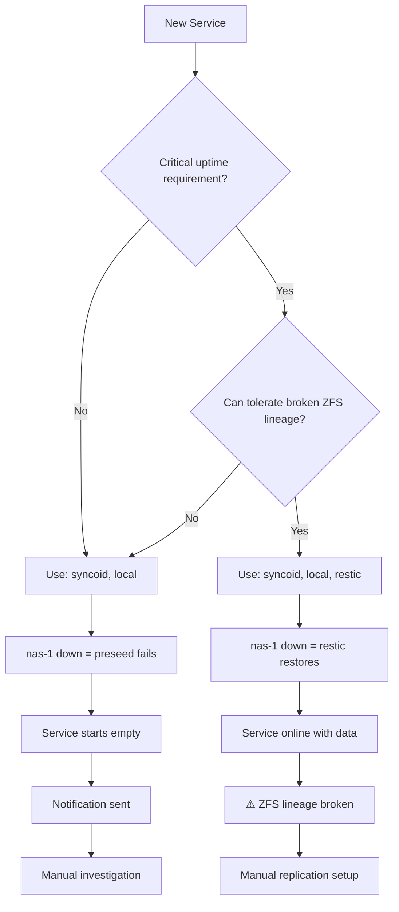

# Preseed Restore Methods Configuration Guide

**Last Updated**: 2025-11-10
**Quick Reference**: Which `restoreMethods` should I use?

## TL;DR

**For homelab (recommended default):**

```nix
restoreMethods = [ "syncoid" "local" ];
```

## Restore Methods Explained

### 1. Syncoid (ZFS Replication)

**What it does**: Block-level ZFS replication from nas-1

**Pros:**
- ✅ Fastest for large datasets
- ✅ Preserves all ZFS snapshots and properties
- ✅ Maintains incremental replication lineage
- ✅ Most efficient use of bandwidth

**Cons:**
- ❌ Requires nas-1 to be online
- ❌ Requires replication configured in Sanoid

**Use case**: Primary restore method for all services

### 2. Local (ZFS Snapshots)

**What it does**: Rollback to most recent local snapshot

**Pros:**
- ✅ Instant rollback (no network required)
- ✅ Preserves ZFS lineage
- ✅ No external dependencies

**Cons:**
- ❌ Limited to snapshot retention window
- ❌ Only works if snapshots exist locally

**Use case**: Automatic fallback when nas-1 unavailable

### 3. Restic (Offsite Backup)

**What it does**: File-level restore from offsite repository

**Pros:**
- ✅ Geographic redundancy
- ✅ Works when all ZFS sources unavailable
- ✅ Can restore from cloud/NFS

**Cons:**
- ❌ **Breaks ZFS incremental replication lineage**
- ❌ Slower than ZFS methods
- ❌ Future syncoid operations require full send
- ❌ Hides infrastructure issues (silent failover)

**Use case**: Manual disaster recovery only

## Configuration Patterns

### Pattern 1: Homelab Default (Recommended)

```nix
restoreMethods = [ "syncoid" "local" ];
```

**When to use:**
- Standard homelab services
- Want to maintain ZFS replication efficiency
- Prefer clear infrastructure failure signals
- Acceptable to manually intervene if nas-1 is down

**Behavior if nas-1 down:**
- Preseed fails (correct signal)
- Service starts empty
- Notification sent
- Manual investigation of infrastructure issue

### Pattern 2: With Restic (Use Sparingly)

```nix
restoreMethods = [ "syncoid" "local" "restic" ];
```

**When to use:**
- Service must come online even if nas-1 is permanently dead
- Immediate availability > ZFS replication efficiency
- Willing to manually re-establish replication after restore

**Behavior if nas-1 down:**
- Preseed succeeds via Restic
- Service comes online with data
- ⚠️ ZFS lineage broken
- Manual work required to re-establish incremental replication

**Post-Restic restore checklist:**

1. Verify service is working with restored data
2. Take new ZFS snapshot: `zfs snapshot tank/services/SERVICE@post-restic`
3. Re-establish replication with full send:

   ```bash
   # On nas-1: Destroy old receive dataset
   zfs destroy -r backup/forge/zfs-recv/SERVICE

   # On forge: Send full snapshot
   syncoid --no-sync-snap tank/services/SERVICE nas-1:backup/forge/zfs-recv/SERVICE
   ```

4. Verify replication working with incremental sends

## Decision Tree



## Examples from Production

### Services Using Syncoid + Local Only

```nix
# Loki - Log aggregation
modules.observability.loki.preseed = {
  enable = true;
  restoreMethods = [ "syncoid" "local" ];
};

# Grafana - Metrics dashboards
modules.observability.grafana.preseed = {
  enable = true;
  restoreMethods = [ "syncoid" "local" ];
};

# qBittorrent - Download client
modules.services.qbittorrent.preseed = {
  enable = true;
  restoreMethods = [ "syncoid" "local" ];
};

# SABnzbd - Download client
modules.services.sabnzbd.preseed = {
  enable = true;
  restoreMethods = [ "syncoid" "local" ];
};
```

### When Restic Might Make Sense (Hypothetical)

```nix
# Security camera NVR with 24/7 recording requirement
modules.services.frigate.preseed = {
  enable = true;
  # Immediate availability critical, willing to sacrifice ZFS efficiency
  restoreMethods = [ "syncoid" "local" "restic" ];
};

# Home automation hub controlling critical systems
modules.services.homeassistant.preseed = {
  enable = true;
  # House automation must work even if nas-1 dead
  restoreMethods = [ "syncoid" "local" "restic" ];
};
```

## Common Questions

### Q: Why not always include Restic for maximum availability?

**A**: Because it optimizes for the wrong problem in a homelab:

- Restic preseed triggers on temporary nas-1 outage (maintenance, network)
- Breaks ZFS lineage unnecessarily
- Hides infrastructure problems that should be investigated
- Creates manual cleanup work

Better approach: Fix nas-1 issue, then rebuild. Preseed works correctly.

### Q: What if nas-1 is permanently dead?

**A**: Manually restore from Restic:

```bash
# 1. Deploy service (preseed fails as expected)
# 2. Manually restore
restic -r /mnt/nas-backup restore latest --target /var/lib/SERVICE --path /var/lib/SERVICE

# 3. Set preseed complete to prevent future restore attempts
zfs set holthome:preseed_complete=yes tank/services/SERVICE

# 4. Rebuild to start service
nixos-rebuild switch
```

### Q: How do I know if my service has Restic in restoreMethods?

```bash
# Search your host config
grep -A 5 "preseed = {" hosts/forge/default.nix | grep restoreMethods
```

## Migration Guide

If your services currently use `[ "syncoid" "local" "restic" ]`, decide per-service:

1. **Most services**: Remove `"restic"` (use Pattern 1)
2. **Critical uptime services**: Keep `"restic"` but document why
3. Update configuration and rebuild

Example migration:

```nix
# Before
modules.services.sonarr.preseed = {
  restoreMethods = [ "syncoid" "local" "restic" ];
};

# After (recommended)
modules.services.sonarr.preseed = {
  restoreMethods = [ "syncoid" "local" ];  # Preserve ZFS lineage
};
```

## See Also

- [Disaster Recovery Preseed Pattern](./disaster-recovery-preseed-pattern.md) - Full implementation details
- [ZFS Replication Setup](./zfs-replication-setup.md) - Syncoid configuration
- [Backup System Onboarding](./backup-system-onboarding.md) - Restic setup
