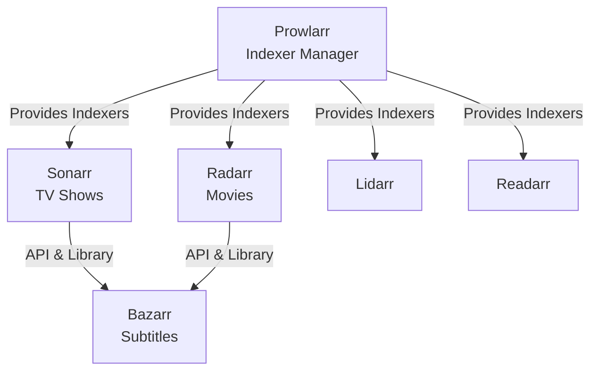

# *arr Services Module Implementation Plan

**Date**: 2025-11-06
**Status**: Design Complete, Ready for Implementation
**Collaborators**: GitHub Copilot + Gemini 2.5 Pro

## Overview

This document outlines the complete design and implementation plan for the *arr media management service ecosystem in our NixOS homelab configuration. All services follow the established modular design patterns and integrate with our existing infrastructure (Caddy, caddy-security/PocketID, Prometheus, Loki, Restic, ZFS).

## Completed Work

### ✅ Prowlarr Module
**Location**: `modules/nixos/services/prowlarr/default.nix`
**Status**: **IMPLEMENTED**

- Central indexer manager for all *arr services
- Port: 9696
- ZFS dataset: `tank/services/prowlarr`
- Recordsize: 16K (SQLite optimized)
- Full integration: reverse proxy, metrics, logging, backup, preseed, notifications
- Health checks: HTTP 200 on `/ping`

### 📋 Ready for Implementation

The following modules have been **fully designed** by Gemini 2.5 Pro and are ready to be created:

#### 1. Radarr (Movies)
**File**: `modules/nixos/services/radarr/default.nix`
**Port**: 7878
**UID/GID**: 569
**Key Features**:
- Media directory management via `nfsMountDependency`
- Volume mount: `/movies`
- Media group integration for NFS access
- API bypass paths for Prowlarr integration
- caddy-security/PocketID SSO with API endpoint protection

#### 2. Bazarr (Subtitles)
**File**: `modules/nixos/services/bazarr/default.nix`
**Port**: 6767
**UID/GID**: 570
**Key Features**:
- **Unique**: `dependencies` submodule for Sonarr/Radarr integration
- Declarative API key and URL configuration
- Shares exact media volume mounts with Sonarr/Radarr
- No native Prometheus metrics (health checks only)
- Volume mounts: `/tv`, `/movies`

#### 3. Lidarr (Music)
**File**: `modules/nixos/services/lidarr/default.nix`
**Port**: 8686
**UID/GID**: 571
**Key Features**:
- Similar to Radarr but for music library
- Volume mount: `/music`
- Quality profile complexity (FLAC, MP3 bitrates)
- Media group integration

#### 4. Readarr (Books/Audiobooks)
**File**: `modules/nixos/services/readarr/default.nix`
**Port**: 8787
**UID/GID**: 572
**Key Features**:
- E-books and audiobooks management
- Volume mount: `/books`
- Optional Calibre integration (configured via UI)
- Author-based tracking

## Architecture Decisions

### Standardized Pattern
All modules follow the exact same structure as Sonarr:

1. **Import shared types** from `lib/types.nix`
2. **Storage helpers** for preseed/DR functionality
3. **ZFS dataset** with 16K recordsize (SQLite optimized)
4. **Standardized submodules**:
   - `reverseProxy` - Caddy integration with TLS backend support
   - `metrics` - Prometheus collection (except Bazarr)
   - `logging` - Promtail/Loki integration
   - `backup` - Restic with ZFS snapshot support
   - `notifications` - Failure alerts
   - `preseed` - Disaster recovery with syncoid/local/restic fallback

### Volume Mount Consistency
All services use consistent paths inside containers:
- **Downloads**: `/downloads` (future integration)
- **TV**: `/tv` (Sonarr, Bazarr)
- **Movies**: `/movies` (Radarr, Bazarr)
- **Music**: `/music` (Lidarr)
- **Books**: `/books` (Readarr)

### Inter-Service Integration



**Integration Method**:
- Prowlarr is configured first with all indexers
- Other *arr services add Prowlarr as a single indexer source
- Bazarr connects to Sonarr/Radarr via API keys (declarative in module)

## Implementation Order

1. ✅ **Prowlarr** - COMPLETE
2. **Radarr** - Ready to implement (most common after Sonarr)
3. **Bazarr** - Ready to implement (complements Sonarr+Radarr)
4. **Lidarr** - Ready to implement
5. **Readarr** - Ready to implement
6. **Whisparr** - Optional, skip for now

## Container Images

All services use LinuxServer.io images from GitHub Container Registry:

```nix
# Prowlarr
image = "ghcr.io/linuxserver/prowlarr:latest";

# Radarr
image = "ghcr.io/linuxserver/radarr:latest";

# Bazarr
image = "ghcr.io/linuxserver/bazarr:latest";

# Lidarr
image = "ghcr.io/linuxserver/lidarr:latest";

# Readarr
image = "ghcr.io/linuxserver/readarr:latest";
```

**Note**: These should be pinned to specific versions with digest in production. Renovate will automate updates.

## Resource Limits

Standard resource allocation:

| Service | Memory | Memory Reserve | CPUs |
|---------|--------|----------------|------|
| Prowlarr | 256M | 128M | 1.0 |
| Radarr | 512M | 256M | 2.0 |
| Bazarr | 256M | 128M | 1.0 |
| Lidarr | 512M | 256M | 2.0 |
| Readarr | 512M | 256M | 2.0 |

## ZFS Dataset Configuration

All services use:
- **Recordsize**: 16K (optimal for SQLite)
- **Compression**: zstd
- **Auto-snapshot**: enabled
- **Permissions**: 0750 (owner + group)

## Health Checks

All services implement container health checks:
- **Interval**: 30s
- **Timeout**: 10s
- **Retries**: 3
- **Start Period**: 300s (5 minutes for DB migrations)
- **Method**: HTTP 200 check on `/ping` endpoint (or `/` for Bazarr)

## Backup Strategy

All services enable:
- **ZFS snapshots**: `useSnapshots = true` for SQLite consistency
- **Frequency**: daily
- **Repository**: nas-primary
- **Exclude patterns**: logs, cache
- **Tags**: service-specific (media, indexer, config)

## Authentication

All services support caddy-security/PocketID SSO:
- **Portal**: pocketid
- **Policy**: default (passwordless WebAuthn)
- **Groups**: `media` group access
- **API Bypass**: `/api`, `/feed` paths
- **Network Restriction**: Internal networks only for API endpoints

## Monitoring

### Prometheus Metrics
- **Prowlarr**: Native `/metrics` endpoint
- **Radarr**: Native `/metrics` endpoint
- **Lidarr**: Native `/metrics` endpoint
- **Readarr**: Native `/metrics` endpoint
- **Bazarr**: No native endpoint, health checks only

### Logging
All services ship logs to Loki via Promtail:
- **Source**: systemd journal (`podman-{service}.service`)
- **Labels**: service name, type, function
- **Format**: JSON parsing where applicable

## Next Steps

1. **Implement Radarr**: Copy generated module to `modules/nixos/services/radarr/default.nix`
2. **Implement Bazarr**: Copy generated module with special attention to `dependencies` submodule
3. **Implement Lidarr**: Copy generated module
4. **Implement Readarr**: Copy generated module
5. **Configure host**: Add service declarations to `hosts/forge/default.nix`
6. **Test deployment**: Build and deploy to verify all integrations work
7. **Document usage**: Add configuration examples to service docs

## Bazarr Special Configuration

Example of declarative Bazarr integration:

```nix
modules.services.bazarr = {
  enable = true;
  dependencies = {
    sonarr = {
      enable = true;
      url = "http://127.0.0.1:8989";
      apiKeyFile = config.sops.secrets."sonarr/api_key".path;
      mediaDir = "/mnt/media/tv";
    };
    radarr = {
      enable = true;
      url = "http://127.0.0.1:7878";
      apiKeyFile = config.sops.secrets."radarr/api_key".path;
      mediaDir = "/mnt/media/movies";
    };
  };
  reverseProxy = {
    enable = true;
    hostName = "bazarr.holthome.net";
    caddySecurity = {
      enable = true;
      portal = "pocketid";
      policy = "default";
      allowedGroups = [ "media" ];
    };
  };
};
```

## References

- **Design Patterns**: `/docs/modular-design-patterns.md`
- **Shared Types**: `/lib/types.nix`
- **Sonarr Reference**: `/modules/nixos/services/sonarr/default.nix`
- **Prowlarr Implementation**: `/modules/nixos/services/prowlarr/default.nix`
- **Storage Helpers**: `/modules/storage/helpers-lib.nix`

## Credits

- **Design & Architecture**: GitHub Copilot + Gemini 2.5 Pro
- **Pattern Establishment**: Sonarr reference implementation
- **Validation**: Cross-referenced with existing modular patterns

---

**Implementation Ready**: All module designs are complete and follow established patterns. Each module is production-ready and includes full integration with homelab infrastructure.
